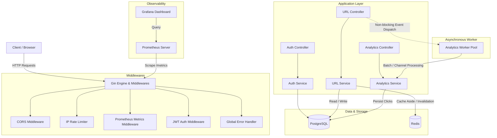
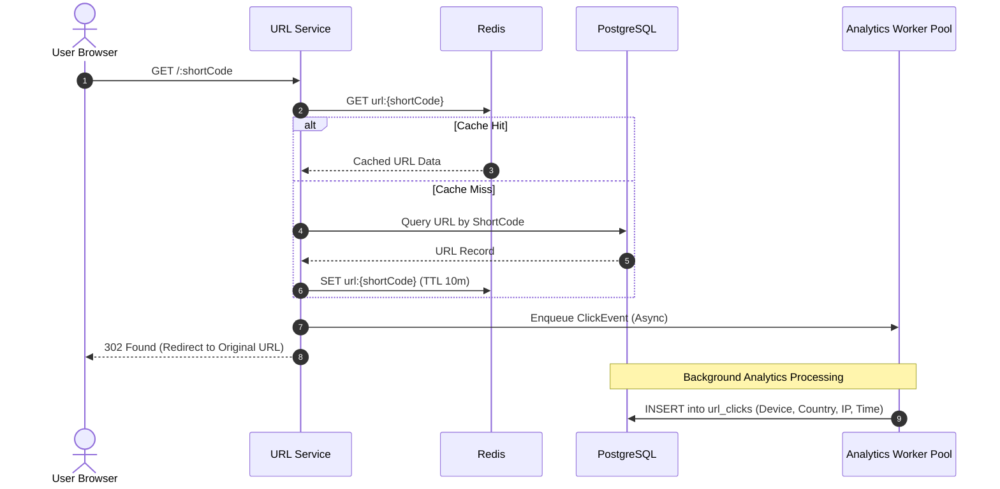

# 🚀 Go URL Shortener & Analytics Platform

[](https://go.dev/)
[](https://gin-gonic.com/)
[](https://www.postgresql.org/)
[](https://redis.io/)
[](https://prometheus.io/)
[](https://grafana.com/)
[](https://www.docker.com/)

A high-performance, production-ready URL Shortener and Click Analytics service built in **Go** using the **Gin** web framework, **GORM**, **PostgreSQL**, and **Redis**.

The service includes JWT-based user authentication, custom link aliases, expiration dates, an asynchronous background worker pool for real-time click tracking, Prometheus metrics, IP rate limiting, and an embedded modern dark-mode Web Dashboard.

---

## 📑 Table of Contents

- [Features](#-features)
- [System Architecture](#-system-architecture)
- [Tech Stack](#-tech-stack)
- [Project Structure](#-project-structure)
- [Getting Started](#-getting-started)
  - [Prerequisites](#prerequisites)
  - [Environment Variables](#environment-variables)
  - [Running with Docker Compose (Recommended)](#running-with-docker-compose-recommended)
  - [Running Locally](#running-locally)
- [API Reference](#-api-reference)
  - [Authentication](#authentication)
  - [URL Management](#url-management)
  - [Click Analytics](#click-analytics)
  - [Redirection & System](#redirection--system)
- [Observability & Monitoring](#-observability--monitoring)
- [Web Dashboard](#-web-dashboard)

---

## ✨ Features

- **⚡ Blazing Fast Redirections**: Redis caching (cache-aside pattern with 10-minute TTL) ensures sub-millisecond redirect responses.
- **🔄 Asynchronous Analytics Worker Pool**: Click events (IP address, user agent, referer, device type, country, timestamp) are enqueued in a buffered channel and processed by a worker pool without blocking user redirects.
- **🏷️ Custom Aliases & Expiration**: Support for user-defined custom aliases or cryptographically secure 6-character Base62 short codes, with optional expiration timestamps.
- **🔒 JWT Authentication & Security**: Secure user registration and login with bcrypt password hashing and token-based route protection.
- **📊 Detailed Click Analytics**: Breakdown by total clicks, unique visitors, device categorization (Desktop, Mobile, Tablet, Bot), and geographical country distribution.
- **🛡️ Rate Limiting & Error Handling**: In-memory IP-based rate limiting (60 requests/minute) and standardized JSON error formatting with custom error types.
- **📈 Prometheus & Grafana Monitoring**: Exposes `/metrics` with HTTP request duration histograms, active in-flight requests, cache hit/miss rates, and worker pool queue depth.
- **🎨 Modern Web UI**: Built-in dark-themed dashboard with Tailwind CSS, Chart.js analytics graphs, QR code generation, and link management.

---

## 🏗️ System Architecture

### High-Level Architecture



### URL Redirection & Caching Flow



---

## 🛠️ Tech Stack

| Component | Technology | Description |
| :--- | :--- | :--- |
| **Language** | [Go 1.26+](https://go.dev/) | High-performance compiled backend language |
| **HTTP Framework** | [Gin Web Framework](https://github.com/gin-gonic/gin) | High-speed HTTP router and middleware pipeline |
| **ORM** | [GORM v1.31](https://gorm.io/) | Object-relational mapping and schema auto-migration |
| **Primary Database** | [PostgreSQL 16](https://www.postgresql.org/) | Relational storage for users, URLs, and click logs |
| **In-Memory Cache** | [Redis 7](https://redis.io/) (`go-redis/v9`) | Caching short URL lookups to minimize DB queries |
| **Authentication** | [JWT](https://github.com/golang-jwt/jwt) & [bcrypt](https://pkg.go.dev/golang.org/x/crypto/bcrypt) | Stateless tokens and secure password hashing |
| **Validation** | [validator/v10](https://github.com/go-playground/validator) | Struct payload validation with custom rules |
| **Metrics** | [Prometheus Client](https://github.com/prometheus/client_golang) | Metric collection (latencies, counters, gauges) |
| **Dashboards** | [Grafana](https://grafana.com/) | Real-time monitoring and telemetry dashboards |
| **Frontend** | HTML5, Tailwind CSS, Chart.js, QRCode.js | Embedded single-page dashboard |
| **Containerization** | Docker & Docker Compose | Multi-container environment orchestration |

---

## 📁 Project Structure

```text
url-shortener/
├── appErrors/              # Custom application errors and HTTP status mapping
├── cache/                  # Redis caching implementation and interface
├── config/                 # Environment variables and database / Redis connection loaders
├── controller/             # HTTP handlers for Auth, URLs, and Analytics
├── dto/                    # Data Transfer Objects for requests and responses
├── metrics/                # Prometheus metrics definitions and registration
├── middleware/             # Gin middlewares (Auth, CORS, Error Handler, Metrics, Rate Limit)
├── models/                 # GORM database models (User, URL, URLClick)
├── prometheus/             # Prometheus scrape configuration
│   └── prometheus.yml
├── repository/             # Database access layer for User, URL, and Analytics
├── routes/                 # Route registration and engine initialization
├── service/                # Business logic layer (Auth, URL, Analytics)
├── static/                 # Embedded Web UI assets
│   ├── css/
│   │   └── style.css
│   ├── favicon.ico
│   └── index.html
├── utils/                  # Helper utilities (JWT, bcrypt, shortcode generator, device/country parsers)
├── validator/              # Struct validator engine and custom rule definitions
├── worker/                 # Asynchronous click analytics worker pool
├── .env.example            # Sample environment variables
├── docker-compose.yml      # Multi-container orchestration (App, Postgres, Redis, Prometheus, Grafana)
├── Dockerfile              # Multi-stage Docker build file
├── go.mod                  # Go module definition and dependencies
├── go.sum                  # Dependency checksums
└── main.go                 # Application entry point
```

---

## 🚀 Getting Started

### Prerequisites

- [Go](https://go.dev/dl/) `1.26` or higher (for local execution)
- [Docker](https://www.docker.com/products/docker-desktop) and [Docker Compose](https://docs.docker.com/compose/)
- [Git](https://git-scm.com/)

---

### Environment Variables

Create a `.env` file in the root directory by copying `.env.example`:

```bash
cp .env.example .env
```

| Variable | Description | Default / Example |
| :--- | :--- | :--- |
| `DB_HOST` | PostgreSQL hostname | `postgres` (Docker) / `localhost` (Local) |
| `DB_PORT` | PostgreSQL port | `5432` |
| `DB_USER` | PostgreSQL username | `postgres` |
| `DB_PASSWORD` | PostgreSQL password | `your_secure_password` |
| `DB_NAME` | PostgreSQL database name | `url_shortener` |
| `SERVER_PORT` | Application HTTP port | `8080` |
| `JWT_SECRET` | Secret key for signing JWT tokens | `super-secret-jwt-key` |
| `REDIS_HOST` | Redis hostname | `redis` (Docker) / `localhost` (Local) |
| `REDIS_PORT` | Redis port | `6379` |

---

### Running with Docker Compose (Recommended)

Start the complete stack (App, PostgreSQL, Redis, Prometheus, and Grafana) with a single command:

```bash
docker compose up --build -d
```

Check running containers:
```bash
docker compose ps
```

Access services:
- **Web App & API**: [http://localhost:8080](http://localhost:8080)
- **Prometheus Metrics**: [http://localhost:9090](http://localhost:9090)
- **Grafana Dashboard**: [http://localhost:3000](http://localhost:3000) *(Default login: `admin` / `admin`)*

To stop all services:
```bash
docker compose down
```

---

### Running Locally

1. **Start PostgreSQL and Redis:**
   You can start standalone instances or use Docker for the dependencies:
   ```bash
   docker run --name postgres -e POSTGRES_PASSWORD=postgres -e POSTGRES_DB=url_shortener -p 5432:5432 -d postgres:16-alpine
   docker run --name redis -p 6379:6379 -d redis:7-alpine
   ```

2. **Configure `.env` for local access:**
   ```env
   DB_HOST=localhost
   DB_PORT=5432
   DB_USER=postgres
   DB_PASSWORD=postgres
   DB_NAME=url_shortener
   SERVER_PORT=8080
   JWT_SECRET=your-secure-jwt-secret
   REDIS_HOST=localhost
   REDIS_PORT=6379
   ```

3. **Install dependencies and run the application:**
   ```bash
   go mod download
   go run main.go
   ```

---

## 📡 API Reference

### Authentication

#### 1. Register a New User
```http
POST /api/v1/auth/register
Content-Type: application/json

{
  "email": "user@example.com",
  "password": "Password123!",
  "confirm_password": "Password123!"
}
```
**Response (200 OK):**
```json
{
  "message": "User registered successfully"
}
```

#### 2. Login
```http
POST /api/v1/auth/login
Content-Type: application/json

{
  "email": "user@example.com",
  "password": "Password123!"
}
```
**Response (200 OK):**
```json
{
  "token": "eyJhbGciOiJIUzI1NiIsInR5cCI6IkpXVCJ9...",
  "user": {
    "ID": 1,
    "email": "user@example.com",
    "created_at": "2026-08-26T12:00:00Z",
    "updated_at": "2026-08-26T12:00:00Z"
  }
}
```

---

### URL Management

> **Note:** All URL management endpoints require the `Authorization: Bearer <JWT_TOKEN>` header.

#### 1. Create Short URL
```http
POST /api/v1/urls
Authorization: Bearer <token>
Content-Type: application/json

{
  "original_url": "https://docs.docker.com/compose/gettingstarted/",
  "custom_alias": "docker-compose-guide",
  "expires_at": "2026-12-31T23:59:59Z"
}
```
*(Both `custom_alias` and `expires_at` are optional).*

**Response (200 OK):**
```json
{
  "ID": 1,
  "UserID": 1,
  "OriginalURL": "https://docs.docker.com/compose/gettingstarted/",
  "ShortCode": "docker-compose-guide",
  "ExpiresAt": "2026-12-31T23:59:59Z",
  "IsActive": true,
  "IsDeleted": false,
  "CreatedAt": "2026-08-26T12:30:00Z",
  "UpdatedAt": "2026-08-26T12:30:00Z"
}
```

#### 2. List User URLs (Paginated)
```http
GET /api/v1/urls?page=1&pageSize=10
Authorization: Bearer <token>
```
**Response (200 OK):**
```json
{
  "data": [
    {
      "ID": 1,
      "UserID": 1,
      "OriginalURL": "https://docs.docker.com/compose/gettingstarted/",
      "ShortCode": "docker-compose-guide",
      "ExpiresAt": "2026-12-31T23:59:59Z",
      "IsActive": true,
      "IsDeleted": false,
      "CreatedAt": "2026-08-26T12:30:00Z",
      "UpdatedAt": "2026-08-26T12:30:00Z"
    }
  ],
  "pagination": {
    "page": 1,
    "size": 10,
    "total": 1,
    "total_pages": 1
  }
}
```

#### 3. Get URL by ID
```http
GET /api/v1/urls/1
Authorization: Bearer <token>
```

#### 4. Update URL
```http
PATCH /api/v1/urls/1
Authorization: Bearer <token>
Content-Type: application/json

{
  "original_url": "https://docs.docker.com/compose/",
  "is_active": true
}
```

#### 5. Activate / Deactivate URL
```http
PATCH /api/v1/urls/1/activate
Authorization: Bearer <token>
```
```http
PATCH /api/v1/urls/1/deactivate
Authorization: Bearer <token>
```

#### 6. Delete URL (Soft Delete)
```http
DELETE /api/v1/urls/1
Authorization: Bearer <token>
```
**Response (200 OK):**
```json
{
  "status": "ok"
}
```

---

### Click Analytics

#### Get URL Analytics
```http
GET /api/v1/urls/1/analytics
Authorization: Bearer <token>
```
**Response (200 OK):**
```json
{
  "total_clicks": 1420,
  "unique_visitors": 980,
  "devices": {
    "desktop": 840,
    "mobile": 520,
    "tablet": 45,
    "bot": 15
  },
  "countries": {
    "TR": 620,
    "US": 410,
    "DE": 230,
    "GB": 160
  }
}
```

---

### Redirection & System

#### 1. Redirect Short URL
```http
GET /:shortCode
```
- **Response**: `302 Found` redirecting to `OriginalURL`.
- **Note**: Triggers asynchronous background click analytics.

#### 2. Health Check
```http
GET /api/health
```
**Response (200 OK):**
```json
{
  "status": "UP",
  "service": "URL SHORTENER SERVICE",
  "version": "1.0.0"
}
```

#### 3. Prometheus Metrics
```http
GET /metrics
```

---

## 📊 Observability & Monitoring

The service natively registers and exposes key metrics to Prometheus:

| Metric Name | Type | Description |
| :--- | :--- | :--- |
| `http_requests_total` | Counter | Total HTTP requests categorized by `method`, `path`, and `status` |
| `http_request_duration_seconds` | Histogram | Request latency distribution across endpoints |
| `http_requests_in_flight` | Gauge | Current number of concurrent HTTP requests being processed |
| `http_errors_total` | Counter | Total number of HTTP error responses |
| `url_redirects_total` | Counter | Total count of short URL redirects performed |
| `cache_hits_total` | Counter | Number of redirect lookups served directly from Redis |
| `cache_misses_total` | Counter | Number of redirect lookups requiring PostgreSQL fallback |
| `analytics_events_total` | Counter | Total click events generated |
| `analytics_events_processed_total` | Counter | Click events successfully written to the database |
| `analytics_events_failed_total` | Counter | Click events that encountered processing errors |
| `analytics_queue_size` | Gauge | Current backlog of unprocessed click events in worker channel |
| `analytics_processing_duration_seconds` | Histogram | Execution time spent by background workers saving click data |
| `cache_invalidation_errors_total` | Counter | Total Redis cache eviction errors |

---

## 🖥️ Web Dashboard

The service bundles a full-featured frontend located at `/` (built with Tailwind CSS and Chart.js):

- **🔑 Authentication**: Clean modal for login and registration.
- **✂️ URL Shortener Form**: Create short links with custom aliases and expiration date pickers.
- **📋 Link Management**: View your links, click counts, status toggles, and direct copy buttons.
- **📱 QR Code Modal**: Instant QR code generator for easy mobile sharing.
- **📈 Analytics Graphs**: Interactive visual breakdown of device categories and country distribution.

Access the dashboard by navigating to **`http://localhost:8080`** in your browser.

---